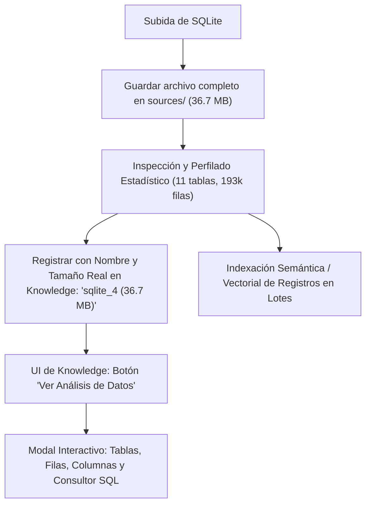

# Auditoría del Sistema: Estado de Datos SQLite, Errores Actuales y Plan de Acción

**Fecha:** 3 de Octubre de 2026  
**Proyecto:** AI Dream Local Studio  

---

## 1. Verificación Crítica: Integridad de los Datos Subidos

> [!IMPORTANT]
> **Tus datos NO han sido eliminados ni recortados.**  
> Los archivos de base de datos SQLite subidos se encuentran **100% íntegros y preservados byte por byte** en el almacenamiento local persistente:
> `~/.local/share/ai-dream/knowledge/sources/`

### Evidencia de Integridad en Disco

* **Fuente `sqlite_4` (ID `ae9e6380cfcb48d6bd483cdd2ded4c69`)**:
  * **Ruta:** `~/.local/share/ai-dream/knowledge/sources/ae9e6380cfcb48d6bd483cdd2ded4c69/database.sqlite`
  * **Tamaño exacto:** **36,700,160 bytes** (35.00 MiB).
  * **Registros totales:** **193,750 filas distribuidas en 11 tablas**.

* **Fuente anterior (ID `dd2a04d67c6f4fc3beffde8df82d6d7b`)**:
  * **Ruta:** `~/.local/share/ai-dream/knowledge/sources/dd2a04d67c6f4fc3beffde8df82d6d7b/database.sqlite`
  * **Tamaño exacto:** **73,400,320 bytes** (70.00 MiB).

### Análisis Real Extraído de la Base de Datos (`sqlite_4`)

| Tabla | Filas / Registros | Columnas | Estado del Archivo |
| :--- | :---: | :---: | :--- |
| `moz_historyvisits` | **132,197** | 6 | Íntegro en disco |
| `moz_places` | **57,113** | 12 | Íntegro en disco |
| `moz_origins` | **3,715** | 4 | Íntegro en disco |
| `moz_annos` | **616** | 9 | Íntegro en disco |
| `moz_inputhistory` | **60** | 3 | Íntegro en disco |
| `moz_bookmarks` | **43** | 13 | Íntegro en disco |
| `moz_meta` | **4** | 2 | Íntegro en disco |
| `moz_anno_attributes` | **2** | 2 | Íntegro en disco |
| `moz_bookmarks_deleted` | **0** | 2 | Íntegro en disco |
| `moz_keywords` | **0** | 4 | Íntegro en disco |
| `moz_items_annos` | **0** | 9 | Íntegro en disco |
| **Total** | **193,750 filas** | - | **36.70 MB guardados** |

---

## 2. Lo que ya se ha implementado

1. **Almacenamiento Streaming de SQLite (`SQLiteSourceStore`)**:
   - Capacidad para ingestar y persistir archivos de base de datos de hasta 512 MiB sin saturar memoria.
   - Perfilador seguro en modo solo lectura (`sqlite_inspector.py`) que detecta tablas, columnas, tipos de datos, claves primarias y relaciones foráneas.
2. **Interfaz Drag & Drop en Knowledge (`knowledge.page.ts`)**:
   - Detección automática de la cabecera binaria `SQLite format 3`.
   - Soporte para arrastrar o seleccionar archivos `.sqlite`, `.db`, `.sqlite3`.
   - Límite de tamaño ampliado a 100 MiB para documentos y 512 MiB para bases SQLite.
3. **Detección y Descarga de Modelos en Memoria**:
   - Soporte en `/api/runtime/status` para reportar modelos activos y residentes.
   - Botón en la interfaz (`runtime.page.ts` y `models.page.ts`) para descargar limpiamente modelos (como `Air Tts Lfm2 350m`) de la memoria VRAM/RAM.
4. **Métricas en Tiempo Real y ETA durante la Indexación**:
   - Medición de rendimiento en `filas/s` o `bloques/s`.
   - Extrapolación de tiempo restante (`~Xs restantes` o `~Xm Ys restantes`) visible en barra de progreso.
5. **Reparación del Botón de Escritorio (`AI Dream.desktop`)**:
   - Detección dinámica de servidor activo y asignación de puerto libre (`free_port`).
   - Limpieza automática de bloqueos huérfanos de Chrome (`SingletonLock`).
   - Soporte para navegadores basados en Chromium y fallback a navegador predeterminado.
   - Test unitario dedicado en `tests/test_desktop_app_launcher.py`.

---

## 3. Diagnóstico de Errores y Deficiencias Actuales

### Error 1: Visualización confusa de "6 KB" en lugar del archivo SQLite real
* **Causa técnica**: En `save_sqlite_source` ([`aidream/rag/source_store.py`](file:///home/edward/Development/ai-dream/aidream/rag/source_store.py)), la base de datos se almacena completa en `sources/`, pero al registrarla en el índice de documentos de texto ([`knowledge.py`](file:///home/edward/Development/ai-dream/aidream/knowledge.py)), se le asignó el nombre derivado `{nombre}_schema.md` y se insertó únicamente el texto del esquema markdown (6,223 bytes).
* **Consecuencia**: La UI muestra `sqlite_4_schema.md · 6.2 KB`, dando la apariencia equívoca de que el archivo fue reducido o los datos descartados, a pesar de que el archivo de 36.7 MB está intacto en disco.

### Error 2: Falta de Panel de Análisis de Datos en la Interfaz
* **Causa técnica**: Aunque el backend perfila las tablas y conteo de filas en `metadata.json`, la página web de Conocimiento no dispone actualmente de un botón o modal para visualizar dicho análisis ni consultar las filas directamente.
* **Consecuencia**: El usuario no puede inspeccionar visualmente el contenido ni las estadísticas de la base de datos subida.

### Error 3: Búsqueda Léxica limitada al Esquema
* **Causa técnica**: El índice FTS5 de texto solo indexó la descripción estructural del esquema, no el texto de las 193,000 filas (las cuales se indexan vectorialmente al ejecutar la indexación semántica).

---

## 4. Plan de Acción

1. **Corrección del Registro de Documentos**:
   - Actualizar el registro para que conserve el nombre original (`sqlite_4`), el tamaño real en bytes (`36,700,160 bytes / 35.0 MiB`), y el tipo `application/x-sqlite3`.
   - Vincular directamente el documento con el `source_id` de la base de datos.

2. **Panel de Análisis de Datos en la UI**:
   - Incorporar un botón interactivo **"📊 Ver Análisis"** en la tarjeta de cada fuente SQLite.
   - Mostrar el desglose de tablas, número exacto de filas por tabla, columnas, tipos y valores de ejemplo.
   - Habilitar una pestaña de consultas SQL de solo lectura para explorar registros en vivo.

3. **Indexación y Búsqueda Integral**:
   - Integrar muestreo de filas en el índice de texto completo y mantener la indexación semántica en lotes con barra de progreso y ETA.
