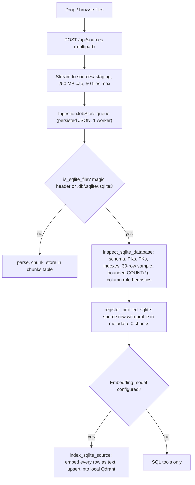

# SQLite files and drag-and-drop in the ai-dream RAG

> **Status: proposal.** Nothing in this document is implemented unless it says so. It is based on a static reading of the code (no code or tests were run), so statements marked **(verify)** are unconfirmed. See the [index](README.md).


Findings come from reading the code in `ai-dream` and `my-rag`. This extends the [gap analysis](01-gap-analysis.md).

---

## 1. Summary

- **ai-dream has no SQLite support at all.** It never touches `.db`, `.sqlite` or `.sqlite3` files. The only SQLite it uses is its own FTS5 index.
- **ai-dream has no drag-and-drop anywhere in the web app.** Uploads use a hidden `<input type="file">`, and the Knowledge page takes only the first file (`files?.[0]`).
- **my-rag already solves most of the SQLite problem.** It stores the database file as-is (it does not flatten it into chunks) and does four things with it:
  - profiles it
  - answers questions with read-only SQL
  - optionally embeds every row into Qdrant
  - uploads it through a durable job queue

  It has a drop zone too, but a weak one (see 4.5).
- **Three limits in ai-dream block a direct port:**
  - **Upload size:** the artifact upload endpoint caps at **32 MiB** and Knowledge at **5 MiB**. SQLite files are routinely larger. my-rag allows 250 MB.
  - **Index size:** the knowledge index holds at most **80,000 characters in total**. Any real database blows past that immediately.
  - **No vectors:** retrieval is lexical only. That is fine for a first version, but it limits what "ask my database" can do.
- **Recommendation:** port the approach, not the code verbatim. Several parts of my-rag's SQLite path are fragile (section 4).

---

## 2. Current state

### 2.1 How my-rag handles a dropped SQLite file



At question time, `POST /api/chat/query` does the following for every SQLite source:
- `execute_sqlite_question` derives a bounded `COUNT(*)` or `SELECT *` from keywords. There is no LLM involved.
- `scan_sqlite_metrics` reports date coverage.
- Qdrant vector search runs when the index is current.
- All of this goes into `answer_question` as `external_evidence`, with an honest `coverage` field.

**Good ideas worth keeping:**
- Databases are opened `mode=ro` with `PRAGMA query_only=ON` and `trusted_schema=OFF`.
- `COUNT(*)` and the metrics scan are bounded with `set_progress_handler` VM-step budgets, and they report `budget_exceeded` instead of lying.
- Evidence carries explicit coverage notes such as "semantic top-k; not exhaustive".
- Complete-set questions are routed to SQL and never answered from top-k vectors.
- Vector indexes are fingerprinted by source SHA-256 plus embedding config, so they go stale correctly.
- The index rebuild stages vectors in a temp file and only swaps once every batch succeeds. A dimension change cannot destroy the old index.
- Uploads are staged, with backup and rollback if ingest fails.

### 2.2 What ai-dream has today

| Area | Reality | Limit |
|---|---|---|
| Knowledge index ([knowledge.py](../../../aidream/knowledge.py)) | SQLite FTS5, lexical only | 100 docs, 40k chars per doc, **80k total** |
| Formats | TXT, MD, text PDF (poppler/OCR optional) | 5 MiB per file |
| Upload transport | JSON body with base64 content | 8 MiB request cap |
| Artifact upload (`/api/artifacts`) | Raw body, typed kinds | **32 MiB**; kinds are `text, json, image, audio, video, document, ...` and none fits a database |
| Chat integration | `_knowledge_context` injects top 4 FTS hits (max 6000 chars) when the session setting is on | Lexical only |
| Frontend | Angular app, signals | No drag-and-drop anywhere |
| Backend | Hand-rolled `http.server`, 4,300-line [http_api.py](../../../aidream/http_api.py) | No multipart. `_read_json_body` demands `Content-Type: application/json` and a `Content-Length` |
| Embeddings and rerank | Declared in the capability map as "not configured" | See the gap analysis |
| Agent tools | `chat_with_tools`, `agent_tools.py`, a skills registry | A natural home for SQL tools |

---

## 3. Target design for ai-dream

### 3.1 Concept: three layers of SQLite knowledge

Treat one dropped SQLite file as **three things**. Build them in order; each is useful alone.

| Layer | What | Needs embeddings? | Value |
|---|---|---|---|
| **A. Schema card** | One text document per database and per table: names, columns, types, PK/FK, row counts, sample values. It goes into the existing FTS index. | No | The model can find the right table and column. Cheap and fast. |
| **B. Live read-only SQL tools** | `sqlite.describe` and `sqlite.query` exposed to the agent and skills. Exact counts, filters, aggregates, joins. | No | Exact answers. Correct for "how many", "total", "latest" questions. RAG cannot do these. |
| **C. Row-level retrieval** | Rows rendered as text. FTS5 first, vectors later. | FTS: no. Vectors: yes. | "Find rows about X" over free-text columns. |

**Why not just flatten every row into chunks (what plain document RAG would do)?** It breaks aggregate questions, it explodes the index (millions of rows), and it throws away types and relations. my-rag reached the same conclusion.

### 3.2 SQL access: improve on my-rag

my-rag's natural-language-to-SQL is keyword and regex heuristics. They are English and Spanish only, and they handle only simple counts, lists and dates. For ai-dream, which already has tool-calling, the recommendation is:

1. **Keep a deterministic fast path** for counts and lists. It can never hallucinate and is easy to test.
2. **Add an LLM tool `sqlite.query(sql)`** with these guards:
   - SELECT only, one statement, enforced by parsing and by an `sqlite3` **authorizer callback** that denies everything except `SQLITE_SELECT`, `SQLITE_READ` and `SQLITE_FUNCTION` on an allow-list.
   - `mode=ro`, `query_only`, `trusted_schema=OFF`, a VM-step budget, a row cap, a wall-clock timeout.
   - `ATTACH`, `load_extension`, `PRAGMA` writes and `readfile`/`writefile`-style functions are blocked.
   - Every result carries `truncated`, `row_count` and the exact SQL executed. The model can show its work.
3. Return **typed results**, so the UI can render a table (and ai-dream's Canvas page exists for that).

The authorizer is a stronger guarantee than my-rag's "we only ever emit our own query text". That approach is fine for fixed templates but would not survive LLM-written SQL.

### 3.3 Upload path

Do not copy the base64 JSON route. Instead:

- **New endpoint:** `POST /api/knowledge/sources` with a **raw streamed body** (like `/api/artifacts`) and headers `X-File-Name` and `X-File-Size`.
- **Stream to disk** in 1 MiB chunks. Never `rfile.read(length)` a 250 MB body into memory. **(verify)** whether the artifact store streams today; the JSON reader does not.
- A separate, larger limit for sources, for example 512 MiB, configurable. Keep the 32 MiB cap for chat attachments.
- **Server-side type detection by content**, not extension or the client's claim:
  - first 16 bytes == `SQLite format 3\0`
  - `%PDF`
  - ZIP magic for DOCX/XLSX/PPTX
  - otherwise try text.
- Then enqueue a **durable job** (port `IngestionJobStore`) so progress survives restarts and the HTTP thread is not held.
- Report progress over the existing SSE mechanism or simple polling.

**Route gotcha:** [http_api.py](../../../aidream/http_api.py) has hand-maintained allow-lists of API paths: around lines 3019, 3034 and 4119 (**verify**, they gate query strings and methods). Any new route must be added to them or it will be rejected.

### 3.4 Storage layout

```
<app-data>/knowledge/
  index.sqlite3            # existing: documents + FTS5
  sources/<id>/original.db # retained original (read-only target for SQL tools)
  sources/<id>/meta.json   # profile, sha256, size, detected kind
  jobs/                    # durable job records
```

- Keep the original file (SQL tools need it) and record its SHA-256 for staleness.
- Never open the user's original in place. Copy it first.
- Handle sidecars (see 4.3).

### 3.5 Drag and drop (frontend)

Requirements:

1. **Window-level drop target.** A full-page overlay appears on `dragenter` with files (`dataTransfer.types` includes `Files`). Use an enter/leave counter, because `dragleave` fires on every child element. Handle `dragover` (`preventDefault`) and `drop`.
2. **Block the browser default** everywhere, so a miss does not navigate away to the file.
3. **Folders:** use `DataTransfer.items[i].webkitGetAsEntry()` and recurse. `dataTransfer.files` returns a bogus entry for a dropped folder. my-rag has this bug (4.5).
4. **Route by context:** dropped on the Knowledge page means ingest into RAG. Dropped in Chat means attach to the message (artifact). Dropped elsewhere means a small chooser: "Add to Knowledge" or "Attach to chat".
5. **Client-side sniffing** with `file.slice(0, 16)` to label the card ("SQLite database · 14 MB") before upload. The server stays the authority.
6. **Per-file cards** with real upload progress (`XMLHttpRequest.upload.onprogress`; `fetch` has no upload progress), then job stages: *storing, profiling, indexing, done / failed*, with Retry on failure.
7. **Accessibility:** a keyboard-reachable "Add files" button stays the primary path. The overlay is announced via `aria-live`, and it must be dismissible with Escape.
8. **Limits before upload:** show size limits and reject oversize files client-side with a clear message.
9. **Privacy notice** if any embedding provider is remote (section 4.2).

Check current browser guidance when implementing, since drag-and-drop and File System APIs have newer options (for example `getAsFileSystemHandle`).

---

## 4. Problems found

Severity: 🔴 fix before shipping, 🟠 should fix, 🟡 nice to have.

### 4.1 In my-rag's SQLite path (do not copy blindly)

| # | Sev | Problem | Where |
|---|---|---|---|
| 1 | 🔴 | **Whole file read into memory, twice.** `register_profiled_sqlite` and `ingest_path` call `path.read_bytes()` to compute SHA-256. With a 250 MB cap that is 250 MB+ of RAM per file. Hash in chunks. | ingestion.py (`my-rag/rag/ingestion.py`) lines 358, 440 |
| 2 | 🔴 | **Fail-closed semantic indexing on tables without a primary key.** One keyless table (very common: logs, join tables) means the *whole database* gets no vectors. Fall back to `rowid`, or skip that table and report it. | sqlite_vectors.py (`my-rag/rag/sqlite_vectors.py`) line 123 |
| 3 | 🟠 | **Embeds every row of every table with no cap, no column selection and no cost estimate.** A 5M-row database means 5M embedding calls. Needs a row budget, a per-table opt-in, and an estimate before starting. | `index_sqlite_source` |
| 4 | 🟠 | **No incremental update.** Any file change triggers a full rebuild of all vectors. | Same |
| 5 | 🟠 | **NL-to-SQL is regex and keyword heuristics**, English and Spanish only, with a whitelist of "accepted" filler words. Fragile and hard to extend. Answer formatting for each result type is hardcoded in Spanish *inside the route handler*. | api.py (`my-rag/rag/api.py`) lines 651-722, 1240-1315 |
| 6 | 🟠 | **`/api/chat/query` loads every chunk into memory on every request** (`ingestion.get_chunks()`), then runs BM25 over them, and `add_semantic_scores` embeds all missing chunks live. The vector cache is a process-global dict that is unbounded and lost on restart. Does not scale. | api.py (`my-rag/rag/api.py`) line 1201; retrieval.py (`my-rag/rag/retrieval.py`) line 16 |
| 7 | 🟠 | **Profile stores sample rows verbatim in source metadata**, up to 30 per table, possibly with personal data. They are persisted in `rag.sqlite3` and sent to the UI. | sqlite_profile.py (`my-rag/rag/sqlite_profile.py`) |
| 8 | 🟡 | The `_classify` role heuristics (language, person name, search query...) are name- and sample-based guesses and can be wrong. They are surfaced to users as facts. Label them "detected". | sqlite_profile.py |
| 9 | 🟡 | `api.py` is 1,333 lines with business logic in route functions. `debug_store` and `conversation_context` are module-level globals. | api.py |
| 10 | 🟡 | `source_id` is a hash of the on-disk path, so moving the data directory changes every ID. | ingestion.py |

### 4.2 Privacy: the big one 🔴

When an embedding provider is **remote**, indexing a SQLite file sends **every row to that provider** (`_render` puts the full row, as JSON, into the text). my-rag does this silently once embeddings are configured, so merely dropping a database triggers it. ai-dream's UI promises "Private, local" ([knowledge.page.ts](../../../web/src/app/pages/knowledge.page.ts)). Shipping this unchanged would break that promise.

Required in ai-dream:
- Never auto-embed on drop. Show "This will send N rows to *<provider name>* (remote)", with an explicit confirm.
- Default row-vectors to **off** for remote providers; allow for providers marked local.
- Same applies to chat: SQL results and retrieved rows go to the chat model. If the model is a remote connection, say so in the answer's provenance.
- Allow per-column exclusion (for example mask `email`, `password`, `token`-named columns by default).

### 4.3 SQLite-specific hazards (not handled in either project)

| # | Sev | Hazard | Recommendation |
|---|---|---|---|
| 1 | 🟠 | **WAL/journal sidecars.** A database in WAL mode keeps recent writes in `name.db-wal`. Dropping only `name.db` silently loses that data, and opening `mode=ro` on a WAL file may need the `-shm`. | Detect WAL mode (header bytes 18-19 == 2). Warn, and accept `-wal`/`-shm` dropped together. Or tell the user to run `PRAGMA wal_checkpoint(TRUNCATE)`. |
| 2 | 🟠 | **Corrupt or hostile files.** Neither project runs `PRAGMA quick_check`, sets `sqlite3_limit`, or caps page count or table count. A crafted file can be slow to profile. | Run `quick_check` under the progress-handler budget. Cap tables and columns profiled. Run profiling in a **subprocess** with a hard timeout and memory limit. |
| 3 | 🟠 | **Encrypted databases (SQLCipher)** do not have the magic header. They are mis-detected as binary text. | Detect high-entropy first page. Report "encrypted or not a SQLite file". |
| 4 | 🟠 | **Views, virtual tables and FTS shadow tables.** Profiling only lists `type='table'`. Views are invisible, and FTS internal tables (`*_content`, `*_data`) show up as user tables. | List views separately. Hide known shadow tables. |
| 5 | 🟡 | **BLOB columns.** They are reduced to `{binary_bytes: n}` text, which is fine, but images or documents inside BLOBs could be offered as artifacts later. | Out of scope for v1. |
| 6 | 🟡 | Very wide or huge-text cells blow up embeddings and prompts. | Truncate per cell and per row. |
| 7 | 🟡 | `PRAGMA user_version`, `application_id` and `journal_mode` are useful identity info. | Add to the profile. |

### 4.4 In ai-dream (existing, relevant)

| # | Sev | Problem |
|---|---|---|
| 1 | 🟠 | **80,000 total indexed characters** is enough for about 5 average books of text. It cannot serve as a RAG store. The cap exists as a safety bound. It needs to become a configurable disk and row budget, not a char count. |
| 2 | 🟠 | **FTS delete is fragile.** `DELETE FROM knowledge_fts WHERE document_id=? AND name=? AND text=?` compares the entire text column. Store the FTS `rowid` and delete by it. Also the text is stored twice (table and FTS). Use an external-content FTS5 table. |
| 3 | 🟠 | **Search requires every term** (`AND` of all terms, max 16). A natural-language question returns nothing. Needs OR with bm25 ranking, prefix matching, and stop-word handling. |
| 4 | 🟠 | **Base64 JSON upload.** 33% overhead, the whole body is held in memory, 8 MiB cap, and the browser builds a giant string. |
| 5 | 🟠 | **`http_api.py` is a 4,300-line single file** with if-chains for routing and several path allow-lists. Adding SQLite endpoints there makes this worse. Put them in a new module like `artifacts/api.py`. |
| 6 | 🟡 | **Knowledge page takes one file** (`files?.[0]`) and cannot pick multiple files or folders. |
| 7 | 🟡 | **No concurrency story for ingestion.** There is no job queue for knowledge today, and `MAX_CONCURRENT_REQUESTS = 8`. Long profiling runs inside a request would starve the server. |
| 8 | 🟡 | The knowledge result UI shows only snippets. There is no way to open the source document or see table-level provenance. |

### 4.5 In my-rag's drag and drop

- Only the single `#dropzone` element is a drop target. Dropping a file elsewhere on the page makes the browser **navigate to the file** and lose app state.
- `drop` handler uses `event.dataTransfer.files`. **Dropped folders arrive as zero-byte "files" or are skipped** and are not traversed.
- No upload progress (`fetch`), and no client-side size or type check. A 300 MB file uploads fully and then gets rejected with a 413.
- No per-file status. One toast says "Uploading N files".
- Folder upload only works through the separate `<input webkitdirectory>` button.
- Job polling is hand-rolled with four module-level flags (`jobsPolling`, `jobsPollAgain`, `watchAllActiveJobs`, `requestedJobIds`). It works but is hard to reason about. In ai-dream, use a signal-based service.

### 4.6 Housekeeping

- my-rag's `data/` directory contains a real `rag.sqlite3`, a Qdrant store, job files, `settings.json` and `atlas.log`. Check that none of it is tracked by git and that `settings.json` contains no secrets (it should only hold environment-variable names; not confirmed).
- Both projects have `__pycache__` and `.pytest_cache` inside the tree.

---

## 5. Work plan

Rough effort: **S** < half a day, **M** 1-2 days, **L** 3+ days.

### Phase 0: groundwork (S-M)
- [ ] **0.1** Create `aidream/knowledge/` package: `api.py` (routes), `sources.py` (source registry), `jobs.py` (port `IngestionJobStore`), keep the old `knowledge.py` working. **M**
- [ ] **0.2** Register routes and update the path allow-lists in `http_api.py`. **S**
- [ ] **0.3** Streaming raw-body reader to disk with a configurable cap. **M**
- [ ] **0.4** Content-sniffing (`detect_kind(path)`), shared by server and tests. **S**

### Phase 1: SQLite as a source, no embeddings (L)
- [ ] **1.1** Safe profiler: chunked SHA-256, `quick_check` under budget, WAL and encryption detection, views, shadow-table filtering, subprocess with timeout. Port ideas from `sqlite_profile.py`. **L**
- [ ] **1.2** Schema-card documents into the existing FTS index (layer A). **S**
- [ ] **1.3** `sqlite.describe` and `sqlite.query` with authorizer, row and step budgets (layer B). **L**
- [ ] **1.4** Register both as agent tools and as skills (`aidream/skills/builtins.py`). **M**
- [ ] **1.5** Deterministic count/list fast path with coverage metadata. **M**
- [ ] **1.6** Replace the 80k-char cap with a configurable budget. Fix FTS delete and use OR-ranked search. **M**

### Phase 2: drag and drop UI (M-L)
- [ ] **2.1** `DropService` (global listeners, counter, overlay) and an `UploadQueueService` (signals, XHR progress, retry). **M**
- [ ] **2.2** Folder traversal via `webkitGetAsEntry`. **S**
- [ ] **2.3** Knowledge page: multi-file, cards, SQLite profile viewer (tables, columns, relations, samples). **M**
- [ ] **2.4** Chat composer drop → attachment. Context chooser elsewhere. **S**
- [ ] **2.5** Accessibility pass (keyboard path, `aria-live`, Escape). **S**

### Phase 3: row retrieval (M-L, depends on the providers package)
- [ ] **3.1** FTS5 row index (no embeddings) with per-table opt-in and row budget. **M**
- [ ] **3.2** Embedding indexer behind the `VectorStore` protocol, only after explicit confirm and with a cost estimate (4.2). Port the staged-swap logic. **L**
- [ ] **3.3** Incremental updates by row hash. **M**

### Phase 4: other formats (M)
- [ ] **4.1** Port DOCX, PPTX, XLSX, CSV, JSON parsers with the zip-bomb limits from my-rag. **M**

**Suggested first milestone: Phase 0 + 1.1-1.4 + 2.1-2.3.** A user can drop a `.db`, see its profile, and ask questions answered with exact SQL, with no embeddings and no data leaving the machine.

---

## 6. Test plan

Port these from my-rag, then add the new ones:

- **Port:** `test_sqlite_profile.py`, `test_sqlite_query.py`, `test_sqlite_metrics.py`, `test_sqlite_vectors.py`, `test_ingestion_jobs.py`, `test_sqlite_upload_queue.py`, `test_extensionless_ingestion.py`.
- **New, safety (must pass):**
  - authorizer rejects `INSERT`, `DROP`, `ATTACH`, `PRAGMA writable_schema`, `load_extension`, multi-statement input;
  - the original file's SHA-256 is unchanged after any query;
  - a query exceeding the VM budget is interrupted and reports `truncated`;
  - corrupt, encrypted and zero-byte files fail with a clear message and do not crash the worker;
  - WAL-mode database without sidecar produces a warning;
  - upload over the cap is rejected **before** the full body is read;
  - path traversal in `X-File-Name` (`../../x.db`) is neutralised.
- **New, behaviour:**
  - table without a primary key still gets profiled and queryable;
  - database with views, FTS shadow tables and BLOBs;
  - restart mid-job resumes or fails cleanly;
  - re-dropping the same file is idempotent. A changed file marks derived indexes stale.
- **Frontend:** drag enter/leave counter with nested elements, folder drop, multi-file, oversize rejection, keyboard-only upload. ai-dream's `web/scripts/smoke-*.mjs` style checks can host these.

---

## 7. Open decisions

1. **Embeddings for rows:** keep v1 strictly local and lexical (recommended), or include vector indexing from the start?
2. **LLM-written SQL:** allow `sqlite.query(sql)` for the model (needs the authorizer; recommended), or keep only deterministic count/list like my-rag?
3. **Size limit for sources:** is 512 MiB enough, or are larger databases expected?
4. **Storage:** copy the original file into the app data directory (safe, uses disk), or reference it in place read-only (no disk cost, but breaks if the file moves or is being written)?
5. **Should Postgres and other SQL connectors** (my-rag's `sql_connectors.py`) be part of this effort, or come later?
