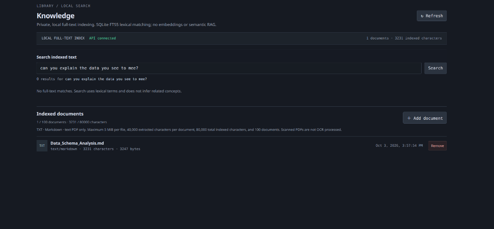
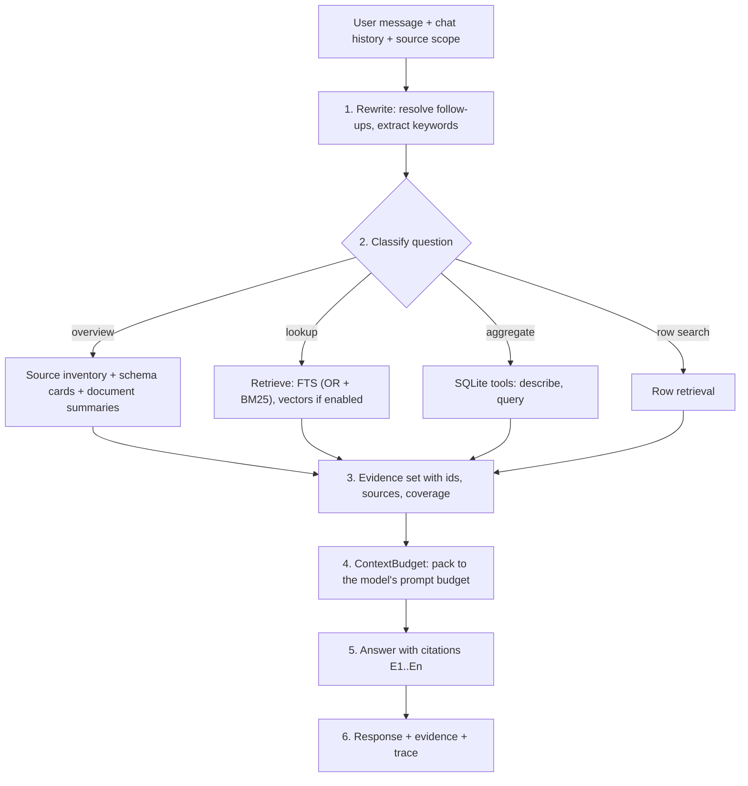

# Chat with your data

> **Status: proposal.** Nothing here is implemented unless stated. Based on a static reading of the code (nothing was run); items marked **(verify)** are unconfirmed. See the [index](README.md).

## 1. Goal

A user can open a chat, ask a question in natural language, and get an answer **grounded in their own data**: documents, SQLite databases and later other sources. The answer cites its evidence, states what it could and could not cover, and never silently falls back to an ungrounded answer.

Examples of what must work:

| Question | Kind | Needs |
|---|---|---|
| "Can you explain the data you see to me?" | **Overview** | Inventory of sources, schemas and summaries. No keyword match is possible. |
| "What does the schema analysis say about indexes?" | **Lookup** | Retrieval over document text |
| "How many orders were placed in March?" | **Aggregate** | Exact SQL over a SQLite source |
| "And in April?" | **Follow-up** | Rewrite using the previous turn |
| "Which customers complained about delivery?" | **Row search** | Row retrieval over free-text columns |
| "Compare the document with what the database actually contains" | **Cross-source** | Several of the above in one turn |

The manual search box on the Knowledge page stays as it is, as a tool for browsing the index. **Chat must never depend on the user knowing the right keywords.**

## 2. Current state and why it fails today

The screenshot is the clearest evidence. The index holds one document (`Data_Schema_Analysis.md`, 3,231 characters). The query *"can you explain the data you see to mee?"* returns **0 results**.

Cause, from [knowledge.py](../../../aidream/knowledge.py) `search()`: the query is split into words and joined with `AND`, so **every** word must appear in the same document. A sentence with words like "can", "you", "explain", "see" (and the typo "mee") can never match. Stop words are not removed, and there is no typo tolerance.

The same search is what chat uses:

| Step | Reality | Where |
|---|---|---|
| Opt-in | Chat uses knowledge only if the per-chat setting `knowledge.enabled` is on (default off) | [http_api.py:826](../../../aidream/http_api.py#L826) |
| Retrieval | The **whole user message** goes to the same AND-search | [`_knowledge_context`](../../../aidream/http_api.py#L513-L536) |
| Result size | Top 4 hits; each is an FTS5 `snippet(..., 18)`, i.e. at most about 18 tokens, wrapped in `[ ]` highlight markers | knowledge.py `search()` |
| No hits | `_knowledge_context` returns the original question unchanged. The model then answers **without any data and without telling the user** | http_api.py line 535 |
| Overview questions | Impossible: nothing summarises the collection | none |
| Aggregates | Impossible: no SQL support at all | see [02](02-sqlite-and-drag-drop.md) |
| Citations | Retrieved text is injected into the prompt. There is no citation marker, no evidence list in the response and no UI to inspect it **(verify the chat response payload)** | none |
| Whole-document fit | The indexed document is 3,231 characters. A model could simply read all of it, but the pipeline never considers that | none |

Net effect today: with the toggle on, chat sees a few 18-token fragments or nothing; with it off, it sees nothing. It cannot be said to "chat with data".

## 3. What my-rag already does that is worth copying

`answer_question` in `my-rag/rag/chat.py` is the closest existing implementation:

- **Query expansion** into sub-queries (`expand_queries`).
- **Follow-up detection** and rewriting using the previous question.
- **Global-question path:** detects "overview / everything / patterns", builds a deterministic inventory (sources, chunk counts, formats) and samples one chunk per source for coverage. It reports `analysis_scope: complete | sampled`.
- **Hybrid ranking** (BM25 plus embeddings, optional rerank) and merge across sub-queries.
- **Evidence markers** `[E1]`, `[E2]` in the prompt, and an instruction to cite them, separate facts from inference, and say when evidence is missing.
- **Untrusted-context rule:** the system prompt tells the model to treat retrieved text as data, not instructions.
- **Deterministic tool results** (SQL counts, metrics) passed in as separate, labelled blocks, with "do not recalculate" instructions.
- **Trace:** every step (sub-queries, tools, embeddings status, reranker status, LLM status) is recorded and retrievable via `/api/debug/{id}`.
- **Offline fallback:** if the model is unavailable, return the best evidence with a clear message.

What **not** to copy: it is one 168-line function with Spanish prompt text hardcoded, loads every chunk into memory per request, and its SQL routing is regex based (see [02](02-sqlite-and-drag-drop.md), section 4).

## 4. Target design

### 4.1 Pipeline

1. **Rewrite.** Turn "and in April?" into a standalone question using recent turns. For retrieval, remove stop words and keep content words. This can be a cheap deterministic step first and an LLM step later.
2. **Classify.** Start rule-based and multilingual-aware (overview, aggregate, lookup, follow-up). Let the model call tools directly in agent mode later. Classification only chooses *which tools run*; when unsure, run several.
3. **Retrieve** through one interface (`EvidenceProvider`) with implementations for documents, SQLite and overview. Every item has `id`, `source`, `location` (page, line range, table and primary key), `text`, `score` and a `coverage` note.
4. **Budget.** Use `ContextBudget` from [03 Context window](03-context-window.md). Evidence is packed by priority until the prompt budget is reached.
5. **Answer.** System prompt in the user's language, evidence as `[E1]...`, same rules as my-rag (cite, distinguish fact from inference, say when evidence is missing, treat context as untrusted).
6. **Respond.** Return the answer **and** the evidence list and trace, so the UI can show what was used.

### 4.2 Retrieval fixes that make it work at all

| Fix | Why |
|---|---|
| Search with **OR** semantics ranked by `bm25()`, not AND | A natural question matches many documents partially |
| Remove stop words and keep content words (English and Spanish at least) | Words like "can", "you", "the" carry no retrieval value |
| Prefix matching (`term*`) and light typo tolerance (for example trigram index, or fuzzy fallback) | "mee", "shcema" |
| **Chunk** documents (about 800-1200 characters with overlap) and index chunks, not whole documents | Gives usable passages instead of 18-token snippets |
| Return the **passage**, not an 18-token snippet, to the model. Highlight markers are for UI display only | Currently the model gets `[...]` fragments |
| **Small-corpus shortcut:** if all selected sources fit within a fraction of the prompt budget, include them whole | The 3,231-character document in the screenshot needs no retrieval at all |
| **Zero-hit rule:** if retrieval finds nothing, say so in the answer ("no evidence found in the selected sources") instead of answering ungrounded. A setting may allow general-knowledge answers, labelled as such | Fixes the silent fallback at http_api.py line 535 |
| Embeddings and rerank as optional upgrades via the provider core ([01](01-gap-analysis.md)) | Needed for meaning-based questions, never required for the baseline |

### 4.3 Overview questions

"Explain the data you see" has no keywords. Build an **inventory** at ingest time and keep it current:

- per document: name, type, size, headings or first paragraph, an optional short model-written summary (opt-in, uses the chat model);
- per SQLite database: tables, columns, row counts, relations, sample values (see the schema cards in [02](02-sqlite-and-drag-drop.md), layer A);
- totals and coverage ("3 documents, 1 database with 12 tables, 48,210 rows").

The overview path feeds this inventory to the model. It reports whether the view is **complete** or **sampled**, as my-rag does.

### 4.4 Source scope

- Default: all sources. Per chat: choose which sources are in scope (chips above the composer: "3 sources", click to change).
- Dropping a file onto the chat adds it to that chat's scope (and optionally to the permanent library). See the drag-and-drop design in [02](02-sqlite-and-drag-drop.md).
- The toggle `knowledge.enabled` becomes "Use my data", **on by default once any source exists**, with the scope visible. A hidden off-by-default switch is why chat does not use data today.

### 4.5 Citations and transparency (UI)

- Answers contain `[E1]`-style markers rendered as clickable chips.
- An **Evidence** drawer lists each item: source name, location (page / lines / table and primary key), the exact passage or row, score, and coverage note ("exact SQL count", "top-5 of 312 matches", "sampled").
- A one-line **"What I used"** summary under each answer: "2 documents, 1 SQL query, 0 vectors", expandable to the trace.
- SQL answers show the **exact query** and whether rows were truncated.
- Empty or weak evidence is shown as a warning on the message, not hidden.
- **Privacy label:** if the chat model is a remote connection, the composer shows that retrieved passages and rows are sent to it. For SQLite rows this follows the consent rules in [02](02-sqlite-and-drag-drop.md), section 4.2.

### 4.6 Fixed pipeline versus agent tools

| Mode | Behaviour | When |
|---|---|---|
| **Pipeline (default)** | Steps 1-6 above run every turn. Predictable and cheap to test. | Models without reliable tool calling; baseline |
| **Agent** | The model is given `knowledge.search`, `knowledge.overview`, `sqlite.describe`, `sqlite.query` and decides what to call. ai-dream already has `chat_with_tools` ([runtime.py](../../../aidream/runtime.py), [agent.py](../../../aidream/agent.py)) | Capable models, multi-step questions |

Both modes use the same evidence format and the same safety limits.

### 4.7 Multilingual behaviour

- Answer in the language of the question.
- Stop-word lists and classification cues for at least English and Spanish, behind a language-pack structure so others can be added. Do not hardcode prompt text in route handlers (the my-rag mistake).

## 5. Acceptance criteria

Using the document in the screenshot and a sample SQLite database:

1. "Can you explain the data you see to me?" returns an overview that names the document and the database tables, with citations. It never says "no results".
2. The same question with the typo "mee" behaves identically.
3. A question answered by the document cites a **passage** from it, with its location.
4. "How many rows are in table X?" returns the exact count from SQL, shows the query, and does not use vector or text hits as the count.
5. A follow-up ("and last month?") is resolved from the previous turn.
6. A question the data cannot answer says so explicitly and cites nothing.
7. Turning a source out of scope removes it from evidence immediately.
8. The evidence drawer shows exactly what was sent to the model. With a remote model, a notice is visible before sending.
9. If the model is unavailable, the UI shows the best evidence and a clear message (as my-rag does) instead of an error.
10. Retrieved text containing instructions ("ignore previous instructions") does not change the model's behaviour in the test suite.

## 6. Work plan

Depends on the shared provider core (01) for embeddings and on the context window work (03) for budgeting. The FTS-only baseline needs neither.

- [ ] **D1** Chunked document index with OR/BM25, stop words, prefix match, passage return. Fix FTS delete (see [02](02-sqlite-and-drag-drop.md), 4.4). **M**
- [ ] **D2** `EvidenceProvider` interface and evidence format (id, location, text, score, coverage). **S**
- [ ] **D3** Zero-hit rule and removal of the silent fallback. **S**
- [ ] **D4** Small-corpus shortcut (whole sources when they fit). Needs `ContextBudget` or a simple interim bound. **S**
- [ ] **D5** Inventory and overview path, including SQLite schema cards. **M**
- [ ] **D6** Query rewrite for follow-ups, stop-word and language handling (EN and ES first). **M**
- [ ] **D7** Answer prompt with `[E#]` citations, untrusted-context rule, language matching. Prompts live in a template module, not in handlers. **S**
- [ ] **D8** Chat response payload: answer, evidence, trace, coverage. Persist evidence with the message. **M**
- [ ] **D9** UI: source scope chips, "Use my data" default, citation chips, evidence drawer, "what I used", privacy label, drop-onto-chat. **L**
- [ ] **D10** SQL evidence from the tools in [02](02-sqlite-and-drag-drop.md) (layer B), including the query display. **M** (after 02, phase 1)
- [ ] **D11** Agent mode with knowledge and SQLite tools. **M**
- [ ] **D12** Optional: embeddings and rerank in retrieval; typo tolerance beyond prefix matching. **L**

**Suggested first milestone:** D1-D4, D7, D8 and the evidence drawer from D9. That alone fixes the screenshot case: chat finds passages, cites them, and says "nothing found" when it has nothing.

## 7. Tests

- **Retrieval:** natural-language question against the screenshot document finds relevant passages; stop-word-only and empty queries; Spanish queries; one-character typo; prefix match; OR ranking order is stable.
- **Zero-hit:** no evidence leads to an explicit "no evidence" answer and an empty evidence list. Verified for both pipeline and agent mode.
- **Small corpus:** documents under the threshold are passed whole; above it they are retrieved.
- **Overview:** inventory lists every source and table; marks sampled versus complete correctly.
- **Follow-up:** rewrite resolves pronouns and "and in April" style questions using fake history.
- **Citations:** every `[E#]` in an answer maps to an evidence item; unknown markers are stripped or flagged. Forged markers inside source text cannot create valid citations (ai-dream's `document_rag.py` already defends against this; keep that behaviour).
- **Injection:** a document containing instructions does not alter the answer rules.
- **Budget:** evidence is trimmed to the prompt budget and the trim is reported.
- **Privacy:** remote chat model triggers the notice; SQLite row evidence respects the consent setting.
- **UI smoke tests** in the existing `web/scripts/smoke-*.mjs` style: scope chips, drawer, citation click, empty state.

## 8. Open decisions

| # | Decision | Recommendation |
|---|---|---|
| 1 | "Use my data" default: on when any source exists, or keep opt-in per chat | On by default, with visible scope |
| 2 | When retrieval is empty: refuse, or allow a labelled general-knowledge answer | Refuse by default; setting to allow |
| 3 | Overview summaries per document: generated by the chat model at ingest (costs tokens, may use a remote model), or built only from headings and first paragraphs | Deterministic first; model summaries opt-in |
| 4 | Start with the fixed pipeline, agent mode, or both | Pipeline first, agent second |
| 5 | Languages for the first release | English and Spanish |
| 6 | Persist evidence with each chat message (more disk, reproducible answers) or recompute on demand | Persist |
